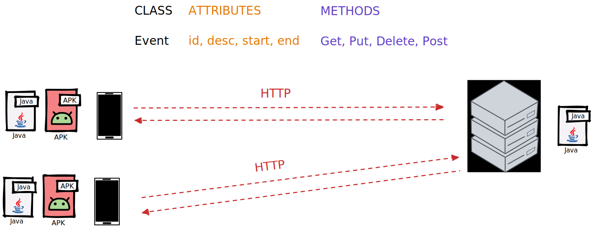

# Kalandar
Kalandar est le nom que nous avons donné à notre Calendrier syncronisé.
  

`kalendar-app` représente le frontend de notre application et prend la forme d'une application Android. 
`kalendar-api` représente le backend de notre application et prend la forme d'une API REST en Java.
  

**Version utilisées :**
- JDK 11
- Android 12 (API v31) 

_Si vous rencontrez un problème de dépendances, il faut ajouter Genson 1.6 au projet._

## Architecture

